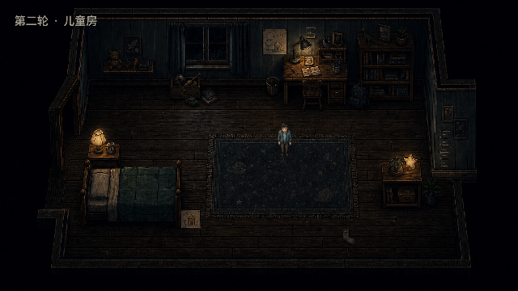

<p align="center">
  
</p>

<h1 align="center">地狱轮回</h1>

<p align="center">
  <strong>HELL CYCLE</strong><br>
  <em>恢复记忆不是胜利。恢复记忆，是惩罚的前奏。</em>
</p>

<p align="center">
  <a href="docs/VERTICAL_SLICE.md"></a>
  <a href="https://godotengine.org/download/archive/4.6.3-stable/"></a>
  
  
  <a href="LICENSE"></a>
</p>

<p align="center">
  <a href="#runtime">实机画面</a> ·
  <a href="#house-remembers">核心机制</a> ·
  <a href="#current-build">当前版本</a> ·
  <a href="#run-locally">本地运行</a> ·
  <a href="#production-docs">制作依据</a>
</p>

---

一个失去记忆的男人在陌生又熟悉的卧室醒来。

门外仍是他的家。每找回一段记忆，房子就变得更安静；每接近一次真相，某个看不见的存在就离他更近。这里没有战斗、能力升级或能够取消过去的完美结局。玩家拥有的唯一力量是理解——而理解正是陷阱。

> **这不是一栋闹鬼的房子，而是一栋拒绝继续替主人隐瞒的房子。**

<a id="runtime"></a>
## 实机画面 · Runtime

<p align="center">
  
</p>

<p align="center"><sub>Godot 4.6.3 · macOS Compatibility 渲染 · 640×360 原生逻辑画布 · V3 运行时美术</sub></p>

玩家可见环境与秦峥已经使用生成式 V3 运行时资产；隐藏 TileMap 继续负责稳定碰撞、门洞、房间坐标与交互。上图是实际运行画面，不是概念图或离线拼接图。

<details>
<summary><strong>展开第一轮五房间实机巡览</strong></summary>
<br>

| 走廊 | 厨房 |
|---|---|
|  |  |

| 儿童房 | 卧室 |
|---|---|
|  |  |

截图的复现命令、引擎版本与渲染信息见 [实机证据说明](docs/evidence/README.md)。
</details>

<a id="house-remembers"></a>
## 房子会记得 · The house remembers

第二轮不随机重排家具，也不靠突然出现的怪物提醒玩家“这里变了”。同一件日常物品留在稳定位置，却开始给出不同证词。

| 第一轮：污迹与单杯 | 第二轮：污迹消失，杯子成对 |
|---|---|
|  |  |

| 第一轮：画纸藏在床下 | 第二轮：画纸主动朝外 |
|---|---|
|  |  |

这些对照来自同一 Godot 场景的合法状态链 `loop_1 → punishment_1 → loop_2`。背景、HUD 与交互坐标由 `GameState` 同步切换。

<table>
  <tr>
    <td width="33%" valign="top"><strong>知识即危险</strong><br><sub>进步不会让角色变强，只会让玩家更清楚自己正在召来什么。</sub></td>
    <td width="33%" valign="top"><strong>缺席胜过怪物</strong><br><sub>妻女通过生活痕迹、物品高度和留白存在；执行者永远没有可见精灵。</sub></td>
    <td width="33%" valign="top"><strong>轮回有收束</strong><br><sub>故事中的循环不会被取消，但玩家会完成一段有明确情感结尾的体验。</sub></td>
  </tr>
</table>

<a id="current-build"></a>
## 当前版本 · Current build

项目正在制作一个 **12–15 分钟、包含两轮探索与两种结束表达的垂直切片**。仓库当前是可运行的开发版本，还不是公开发行版。

| 已经可以验证 | 正在制作 | 发布前仍需完成 |
|---|---|---|
| 五个连通房间、移动碰撞、稳定交互 | 客厅第二轮与时钟谜题 | 完整惩罚时间线与两种结尾 |
| 第一轮三个记忆碎片与六种发现顺序 | 暗格、录音带与状态覆盖层 | UI、音频、FX 最终美术验收 |
| V3 第一轮五房间与两组第二轮回应 | 角色动画与移动观感录屏 | 五名不知情玩家盲测 |

- **目标平台：** Windows x86_64
- **开发环境：** Apple Silicon Mac + Godot 4.6.3 Standard
- **当前验证：** 9 项冒烟测试通过，Windows Debug 导出链通过
- **明确不做：** 战斗、追逐 AI、第三轮、程序化房间、跨启动存档

## 体验目标 · Experience

| 项目 | 垂直切片目标 |
|---|---|
| 类型 | 2D 像素心理恐怖 / 知识驱动探索 |
| 视角 | 俯视角、连续五房间住宅 |
| 时长 | 首次游玩 12–15 分钟 |
| 输入 | <kbd>WASD</kbd> / 方向键移动 · <kbd>E</kbd> 调查 · <kbd>Esc</kbd> 暂停 |
| 语言 | 简体中文；玩家文本全部外置 |
| 恐怖手段 | 环境回应、策略性静默、不可见惩罚 |

## 视觉方向 · Visual direction

<p align="center">
  
</p>

- 第一轮先建立可信的普通家庭住宅，异常只存在于边缘。
- 夜墨、冷墙、旧纸、病灯与焦红承担固定叙事语义。
- 关键物不依赖发光描边、任务箭头或稀有度颜色才能被发现。
- 火只在记忆边缘出现；惩罚阶段才允许焦红侵入画面。

概念主视觉负责表达最终气质，不冒充实机；每项运行时资产必须经过 640×360 Godot 截图、状态对照与人工观感评审。完整规则见 [美术圣经](docs/ART_BIBLE.md) 与 [运行时美术评审](docs/ART_REVIEW.md)。

<a id="run-locally"></a>
## 本地运行 · Run locally

当前没有正式 Release 下载；请从源码运行开发版本。

### macOS 开发环境

```sh
git clone https://github.com/David-coder-hnu/David-Luo-s-game.git
cd David-Luo-s-game

GODOT="$HOME/Applications/Godot-4.6.3-stable.app/Contents/MacOS/Godot"
"$GODOT" --editor --path .
```

### Windows

1. 安装 Godot `4.6.3-stable` Standard（非 .NET）。
2. 克隆或下载仓库。
3. 在 Godot Project Manager 中导入根目录的 `project.godot`。
4. 打开项目后按 <kbd>F6</kbd> / <kbd>F5</kbd> 运行。

锁定的 Mac 路径、测试命令与 Windows 导出方式见 [开发环境说明](docs/DEVELOPMENT.md)。

<a id="production-docs"></a>
## 制作依据 · Production docs

这个仓库把设计当作可执行规格，而不是灵感备忘录。实现必须引用稳定 ID、状态契约和可复现证据；归档构想不能覆盖已批准决定。

| 入口 | 解决的问题 |
|---|---|
| [游戏愿景](docs/GAME_VISION.md) · [关键决定](docs/DECISIONS.md) | 为什么做，以及哪些取舍已经锁定 |
| [垂直切片](docs/VERTICAL_SLICE.md) · [叙事节拍](docs/NARRATIVE_BEATS.md) | 当前到底做什么，以及玩家会经历什么 |
| [美术圣经](docs/ART_BIBLE.md) · [关卡灰盒](docs/LEVEL_BLOCKOUT.md) | 画面语言、房间坐标、门洞和视线 |
| [技术设计](docs/TECHNICAL_DESIGN.md) · [实现契约](docs/IMPLEMENTATION_CONTRACTS.md) | 状态、信号、稳定 ID 与错误语义 |
| [资产清单](docs/ASSET_MANIFEST.md) · [资产来源](docs/ASSET_CREDITS.md) | 需要生产什么，以及每项资产从哪里来 |
| [测试计划](docs/PLAYTEST.md) · [实机证据](docs/evidence/README.md) | 如何证明功能正确、体验假设成立 |

完整权威顺序见 [制作文档索引](docs/README.md)。`docs/design/` 仅保存历史归档，不是实现需求。

## 贡献与许可 · Contributing

开始贡献前请阅读 [CONTRIBUTING.md](CONTRIBUTING.md)。每项改动都需要说明它服务于哪条体验原则，并附上与风险相称的验证证据。

代码与当前文档使用 [MIT License](LICENSE)。美术、音频、字体和生成式资产按照 [ASSET_CREDITS.md](docs/ASSET_CREDITS.md) 单独登记；仓库中的位置不会自动改变它们的许可状态。

<details>
<summary><strong>内容提示 · Content note</strong></summary>
<br>
本作涉及家庭暴力、酒精依赖、儿童受害、火灾、自杀及死亡等主题。垂直切片不直接呈现暴力过程，而通过环境、文字和声音暗示其后果。酒精、失忆和自毁不会被写成免责或已经完成的赎罪。
</details>

---

<p align="center">
  <sub>“你记得得越多，它就离你越近。”</sub>
</p>
