

  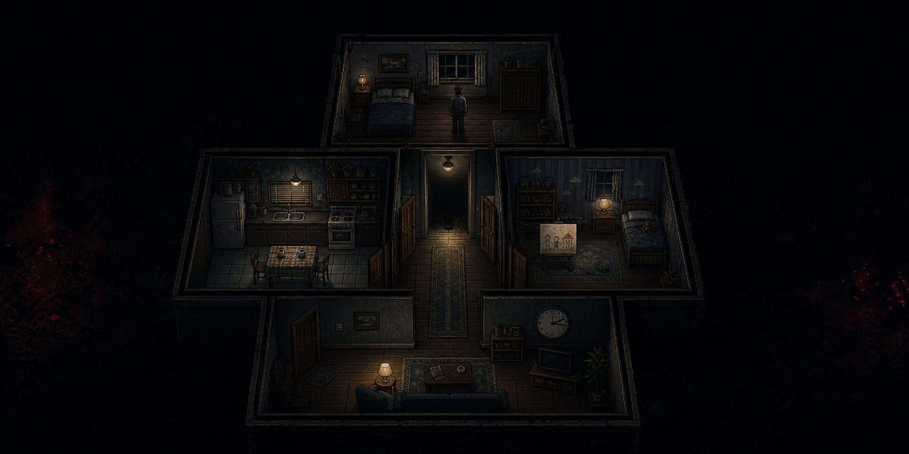

<h1 align="center">地狱轮回</h1>

  <strong>HELL CYCLE</strong> 
  <em>恢复记忆不是胜利。恢复记忆，是惩罚的前奏。</em>

  
  
  
  
  

  <a href="#-the-house-remembers">游戏理念</a> ·
  <a href="#-current-milestone">当前里程碑</a> ·
  <a href="#-visual-language">视觉语言</a> ·
  <a href="#-designed-before-coded">制作规格</a>

---

## The house remembers.

一个失去记忆的男人在陌生又熟悉的卧室醒来。

门外仍是他的家，但物品的位置、墙上的痕迹和远处的声音都在等待他想起什么。每找回一段记忆，房子就变得更安静；每接近一次真相，某个看不见的存在就离他更近。

这里没有战斗，没有能力升级，也没有能够取消过去的完美结局。玩家拥有的唯一力量，是理解——而理解正是陷阱。

<table>
  <tr>
    <td width="33%" valign="top"><strong>知识即危险</strong> 进步不让角色变强，只让玩家越来越清楚自己正在召来什么。</td>
    <td width="33%" valign="top"><strong>房子会回应</strong> 变化不是随机惊吓。每个位置、声音和缺席都指向一段具体记忆。</td>
    <td width="33%" valign="top"><strong>作品有结尾</strong> 故事中的轮回永远继续，但玩家会完成一段拥有明确情感收束的体验。</td>
  </tr>
</table>

## The cycle

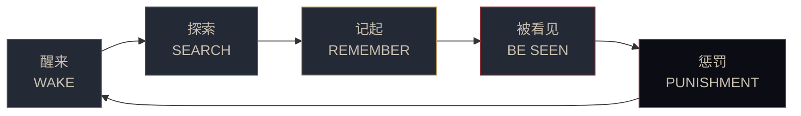

## Current milestone

当前目标不是一份只能展示技术的原型，而是一个 **12–15 分钟、包含两轮探索、可以正式结束的垂直切片**。

- [x] 产品愿景、叙事责任与剧透边界
- [x] 双轮流程、逐拍文本与两种结束表达
- [x] 五房间精确灰盒、状态机和数据契约
- [x] 美术、UI、音频与完整资产清单
- [x] AI 任务图、功能验收和盲测阶段门
- [x] 32px 垂直切片图像资产 V2 与确定性构图标杆
- [x] Godot 4.6.3 Mac 开发基线与 Windows x86_64 导出链
- [x] 设置持久化、GameState 不变量与中文分页文本底座
- [x] Godot 五房间灰盒、移动碰撞、房间相机、稳定交互与首房间记录
- [x] 三个第一轮碎片、六种发现顺序与幂等复读
- [ ] 场景组装、运行时美术验收、shader 与声音实装
- [ ] 五人不知情盲测

切片只验证三个问题：玩家是否会主动调查；知道继续有代价后是否会犹豫；房子回应上一轮行为时，玩家是否感到它记得的是自己。

## Visual language

  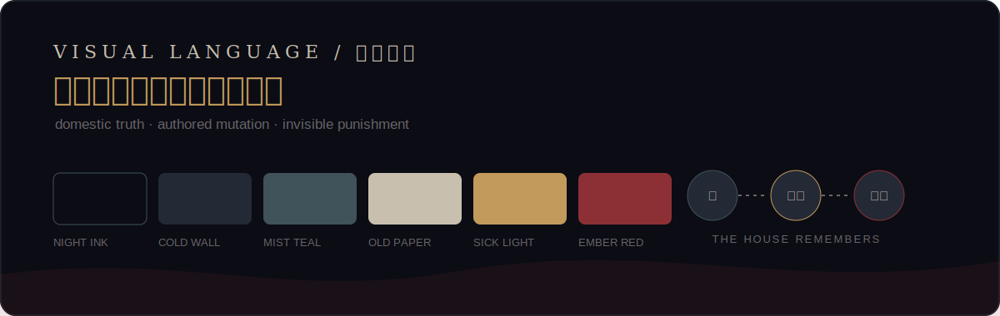

- **640×360** 内部分辨率，**32×32** 像素瓦片与 **32×48** 主角，整数缩放。
- 夜墨、冷墙、旧纸、病灯与焦红构成受约束的低饱和色板。
- 第一轮先建立可信住宅；第二轮让同一件日常物品开始指控玩家。
- 执行者没有精灵。恐怖来自光源消失、声音停止和可见距离缩短。

> 主视觉是概念目标，不是游戏实机截图。游戏内资产按同一色板制作，并以 Godot 运行证据逐项验收。

### First-loop runtime tour

  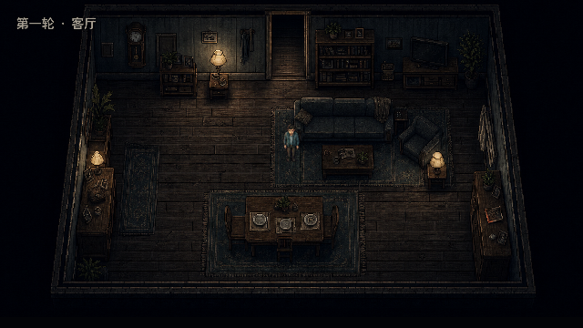

> Godot 4.6.3 在 Mac 开发环境实际运行。玩家可见环境与秦峥均使用生成式 V3 运行时资产；隐藏 TileMap 继续负责稳定碰撞、房间坐标与交互。所有图片保持 640×360 原生逻辑画布，不冒充最终发布画面。

<strong>查看其余四个房间的真实运行画面</strong>

 

| 走廊 | 厨房 |
|---|---|
| 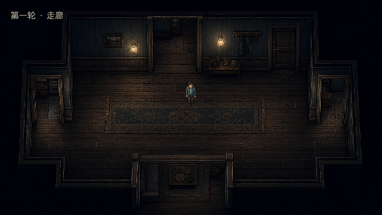 | 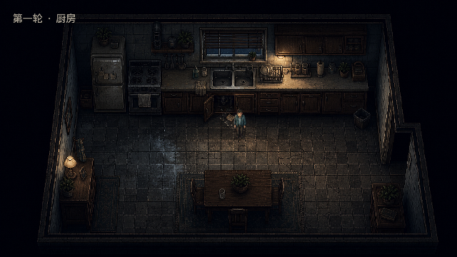 |

| 儿童房 | 客厅 |
|---|---|
| 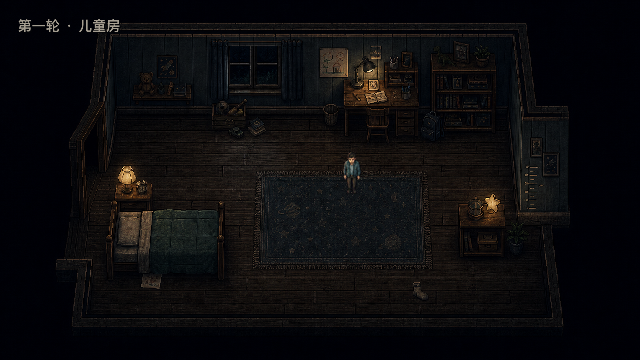 | 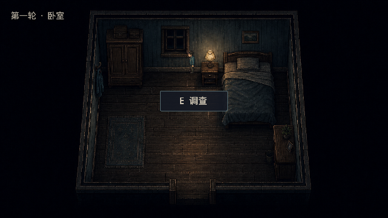 |

截图复现方式、引擎与渲染信息见 [`docs/evidence/`](docs/evidence/README.md)。

### The house remembers

| 第一轮：留下的污迹与单杯 | 第二轮：污迹消失，杯子成对 |
|---|---|
|  | 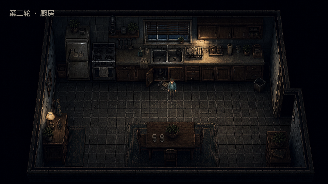 |

> 两张图来自同一 Godot 场景的合法状态链，不是概念图拼接。房屋不靠随机换皮制造恐怖，而是让同一件日常物品在第二轮改变证词。

<strong>查看垂直切片图像资产 V2（REVIEW）</strong>

 

  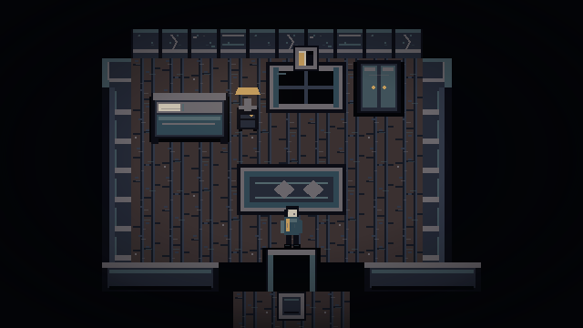

> 上图由实际运行时图集确定性合成，是比例与构图标杆，不是 Godot 实机截图；对应资产仍需运行时三状态验收。

| 第一轮记忆 | 第二轮回应 |
|---|---|
| 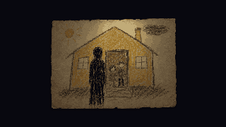 | 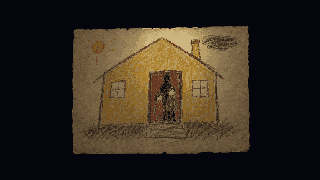 |
| 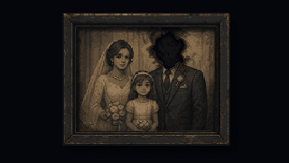 | 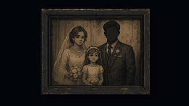 |

环境瓦片、83 个稳定图集区域、角色帧、UI、FX、640×360构图标杆与全部可编辑源文件见 [`assets/game/`](assets/game/README.md)。第一轮五房间已提供实机证据；运行时资产仍为 `REVIEW`，第二轮、惩罚态和角色动画尚未完成评审。

<strong>查看五房间灰盒</strong>

 

  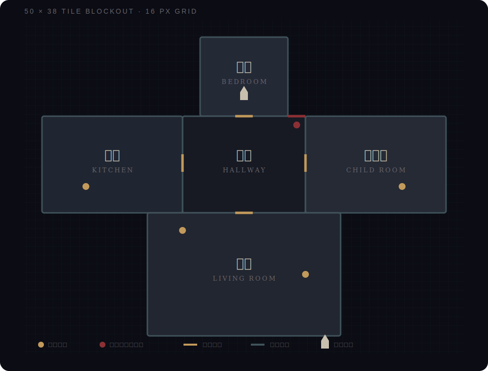

厨房、儿童房与客厅围绕中央走廊布置，距离保持近似公平；第二轮只改变内容，不改变墙体和通路。

## Designed before coded

这个仓库把设计当作可执行规格，而不是灵感备忘录。AI 辅助开发必须依据稳定 ID、任务契约和可复现验收推进，不能自行发明剧情或系统。

| 领域 | 权威文档 | 已锁定内容 |
|---|---|---|
| 产品 | [Game Vision](docs/GAME_VISION.md) · [Decisions](docs/DECISIONS.md) | 体验支柱、责任表达、结尾哲学 |
| 内容 | [Vertical Slice](docs/VERTICAL_SLICE.md) · [Narrative Beats](docs/NARRATIVE_BEATS.md) | 双轮流程、全部关键文本、02:17 谜题 |
| 视觉 | [Art Bible](docs/ART_BIBLE.md) · [Art Review](docs/ART_REVIEW.md) · [Level Blockout](docs/LEVEL_BLOCKOUT.md) | 色板、质量门、精确坐标与视线 |
| 交互 | [UI/UX](docs/UI_UX_SPEC.md) · [Audio Direction](docs/AUDIO_DIRECTION.md) | 屏幕状态、按住确认、逐拍声音 |
| 工程 | [Technical Design](docs/TECHNICAL_DESIGN.md) · [Contracts](docs/IMPLEMENTATION_CONTRACTS.md) | 状态不变量、接口、信号和错误语义 |
| 制作 | [Asset Manifest](docs/ASSET_MANIFEST.md) · [AI Build Protocol](docs/AI_BUILD_PROTOCOL.md) | 穷举资产、依赖图、任务完成定义 |
| 验证 | [Playtest](docs/PLAYTEST.md) · [Roadmap](docs/ROADMAP.md) | 六顺序回归、盲测指标、阶段门 |

完整的文档权威顺序与冲突处理规则见 [`docs/README.md`](docs/README.md)。`docs/design/` 仅保存已归档的立项历史稿。

## Experience target

| 维度 | 垂直切片 |
|---|---|
| 类型 | 2D 像素心理恐怖 / 知识驱动探索 |
| 视角 | 俯视角、连续五房间住宅 |
| 时长 | 首次游玩 12–15 分钟 |
| 输入 | <kbd>WASD</kbd> / 方向键移动，<kbd>E</kbd> 调查，<kbd>Esc</kbd> 暂停 |
| 平台 | Windows x86_64 |
| 语言 | 简体中文；文本从第一天起外置 |
| 引擎 | Godot 4.6.3-stable / GDScript |
| 恐怖手段 | 环境回应、策略性静默、不可见惩罚 |

## Content note

展开内容提示

 
本作涉及家庭暴力、酒精依赖、儿童受害、火灾、自杀及死亡等主题。垂直切片不直接呈现暴力过程，而通过环境、文字和声音暗示其后果。酒精、失忆和自毁不会被写成免责或已经完成的赎罪。

## Contributing & license

开始贡献前请阅读 [`CONTRIBUTING.md`](CONTRIBUTING.md)。任何变更都必须说明服务于哪条体验原则，并提供相应验收证据。

代码与当前文档采用 [MIT License](LICENSE)。美术、音频、字体及第三方素材按照 [`ASSET_CREDITS.md`](docs/ASSET_CREDITS.md) 逐项登记；没有可靠来源和许可的资产不会进入发布包。

---

  “你记得得越多，它就离你越近。”

