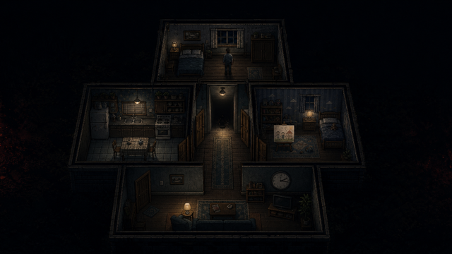
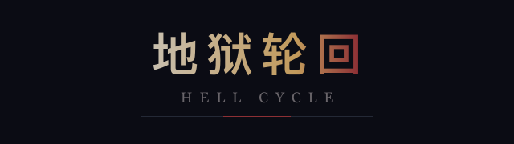
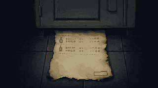
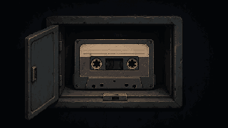
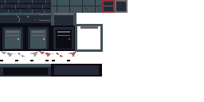
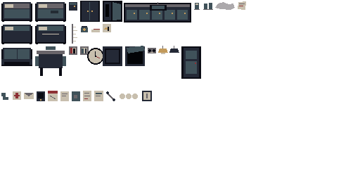
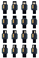
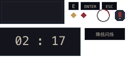

# 垂直切片图像资产包

状态：**视觉资产已生产并通过静态检查**<br>
适用版本：Vertical Slice 0.1<br>
最后更新：2026-07-13

本目录包含当前双轮垂直切片所需的全部图像美术资产。音频、Godot shader 代码和场景动画不属于本目录。

## 预览

### 标题





### 记忆碎片

| 第一轮 | 第二轮 |
|---|---|
|  |  |
|  |  |

| 收据 | 录音带 |
|---|---|
|  |  |

### 图集









## 目录

```text
assets/game/
├── atlas_regions.json              # 图集区域与角色帧契约
├── atlases/
│   ├── environment_tiles.png       # 16px 环境瓦片
│   └── props_atlas.png             # 家具、线索、变体、非关键道具
├── characters/
│   └── qin_zheng_spritesheet.png   # 4方向×4帧，单帧16×24
├── closeups/
│   ├── kitchen_receipt.png
│   ├── child_drawing_loop1.png
│   ├── child_drawing_loop2.png
│   ├── wedding_photo_loop1.png
│   ├── wedding_photo_loop2.png
│   └── memory_tape.png
├── fx/
│   └── fx_patterns.png             # 暗角与焦红边缘纹理
├── ui/
│   ├── title_background.png
│   ├── wordmark.png
│   └── ui_atlas.png
└── source/
    ├── *.svg                       # 确定性可编辑像素源
    ├── atlas_regions.json
    └── generated/                  # 生成图高分辨率母版与提示记录
```

## Godot 导入设置

所有像素图集和角色帧：

- Filter：关闭；
- Mipmaps：关闭；
- Repeat：Disabled；
- Compression Mode：Lossless；
- Scale：1.0；
- 场景只使用整数位置和整数缩放。

记忆特写与标题背景保持 320×180 / 640×360 原始尺寸，不在运行时进行非整数缩放。若窗口放大，跟随项目整数缩放策略。

## 图集使用

区域、尺寸、角色行列语义统一记录在 [`atlas_regions.json`](atlas_regions.json)。实现不得按肉眼重新猜区域，也不得使用数组位置代替稳定 `id`。

- 环境瓦片基础单元为 16×16；
- 角色单帧为 16×24；行依次为下、上、左、右；
- 道具采用显式矩形区域；
- UI 图集中的文字只是视觉样例，最终中文正文仍由本地化字体渲染。

## 编辑与再生成

- 首次使用执行 `pnpm install`；资产工具唯一依赖是锁定版本的 `sharp`。
- `pnpm art:build-sources` 重建确定性 SVG 源；`pnpm art:export` 将其按原尺寸导出为 PNG。
- `pnpm art:process-generated` 重建六张有限色运行时特写。
- `pnpm art:verify` 检查栅格尺寸、图集越界、重复 ID 和确定性源文件色板。
- `pnpm art:build` 依次执行全部步骤并完成最终验证。
- 确定性资产由根目录 [`tools/build_visual_assets.mjs`](../../tools/build_visual_assets.mjs) 生成；修改脚本后重新导出 SVG 和 PNG。
- 复杂特写的高分辨率母版与最终提示保存在 [`source/generated/`](source/generated/)。
- 根目录 [`tools/process_generated_assets.mjs`](../../tools/process_generated_assets.mjs) 使用最近邻缩放、32 色无抖动量化生成 320×180 运行时特写；禁止直接导入高分辨率母版。
- 不直接覆盖 `closeups/` 中的批准版本；变更先生成带版本号的新文件，完成前后对照后再更新区域消费者。
- 概念主视觉可以作光影参考，不能直接切割成家具或角色精灵。

## 设计边界

- 执行者没有任何图像资产；
- 切片没有妻女的场景幽灵精灵；
- 没有血液、尸体、伤口和暴力过程图像；
- 生成特写中的伪文字不承担叙事，真实文字由本地化层显示；
- 第二轮只替换指定图像，不修改房屋碰撞与通路。
